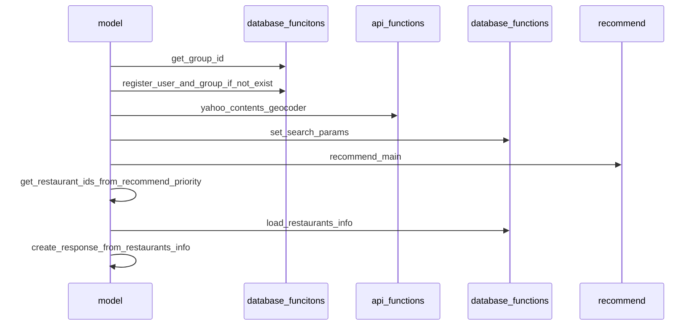

# Reskima
https://reskima.com

mainブランチは開発環境．

本番環境はproductionブランチに置く．本番環境についての詳細はproductionブランチのREADMEに記載．productionにpushすると自動デプロイが走るので注意．

## 起動方法
docker-compose.ymlのあるディレクトリで

```
docker compose build
docker compose up -d
```
コンテナのcreateがdoneになっても，アプリの起動が完了するまでは待つ必要がある．
dbの実体はdockerが作るvolumeに保存される．
**localhost:80でアプリにアクセスできる．**

起動後は次のポートが内部に開く．各コンテナの内部からは見ることができる．
- react 
  - 3000
- python-flask
  - 5000
- mysql
  - 3306
- https
  - 80, 443

## コンテナ内に入りたい場合
```
docker exec -it react bash
```
`react`を`python-flask` `mysql`にすればそれぞれのコンテナに入って作業できる．

## flask appを手動起動する場合
デフォルトではDockerfiles/Dockerfile-pythonで自動起動するようにしているが，それだとデバッグモードのコンソールが開かない．flask appをコンソールから起動させたい場合は，

```
docker exec -it python-flask bash
python app.py
```
を実行する．docker-composeの自動起動コマンドはコメントアウトさせておく．

## pytest
flask appのテストは，app.pyのあるディレクトリで`pytest ./test`を実行する．


## info のシーケンス図

