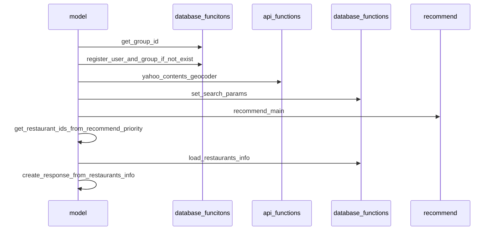

# Reskima

## 本番環境
* https://reskima.com
* productionブランチに何かがpushされたらgithub actionsの自動デプロイが走る
* **デプロイされてから最大10分ほど経たないとサイトにはアクセスできないので注意**
* VMインスタンス内で直接docker-composeするときはrootでやらないとエラーになる
* .envファイルはサーバー内で直接編集する
## デプロイの方法
1. (ローカルで)**origin/mainからこのブランチにマージ**
2. productionブランチとしてpush
3. 本番環境で自動ビルドが走る

## 初回環境構築の手順
サーバーで次を実行
```
git clone git@github.com:seal-git/22zemi.git
cd 22zemi
vi .env
```

`.env`を編集する

```
git checkout production
docker compose build
docker compose up
```

正しくコンテナが建っているか確認する。以降はデプロイすれば自動でproductionブランチが更新される。


## info のシーケンス図

