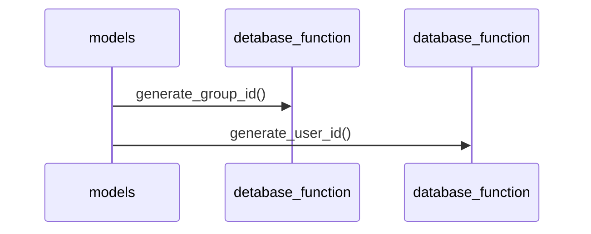
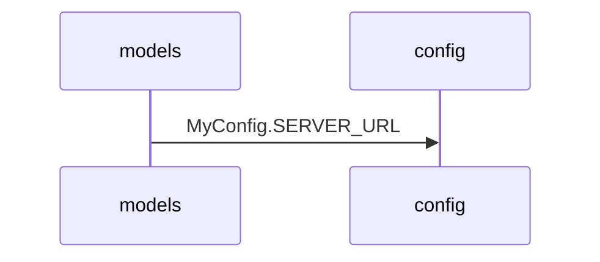
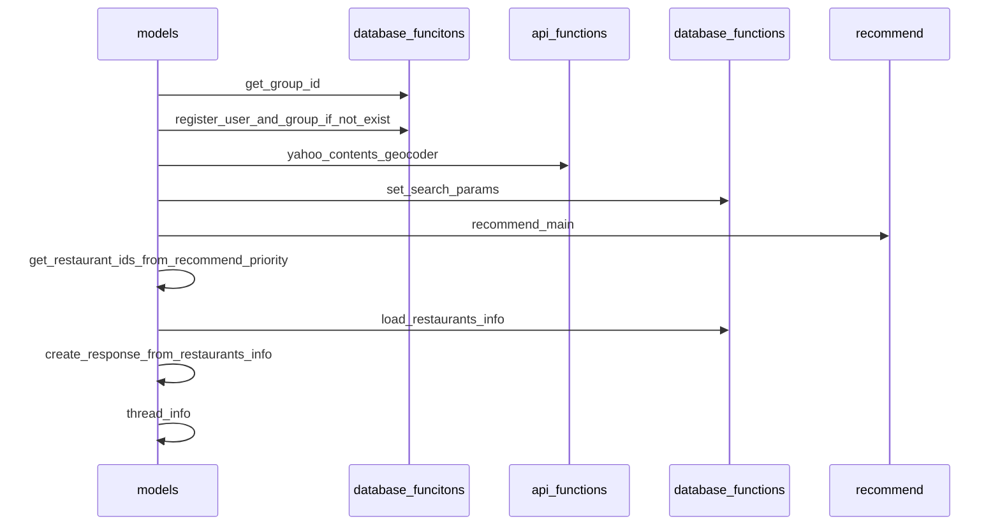
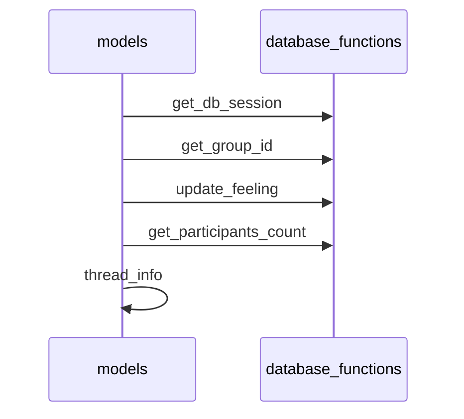

シーケンス図
================

## init

```mermaid
sequenceDiagram
    models ->> detabase_function : generate_group_id()
    models ->> database_function : generate_user_id()
```

## invite

```mermaid
sequenceDiagram
    models ->> config : MyConfig.SERVER_URL
```

## info

```mermaid
sequenceDiagram
  models ->> database_funcitons : get_group_id
  models ->> database_funcitons : register_user_and_group_if_not_exist
  models ->> api_functions : yahoo_contents_geocoder
  models ->> database_functions : set_search_params
  models ->> recommend : recommend_main
  models ->> models : get_restaurant_ids_from_recommend_priority
  models ->> database_functions : load_restaurants_info
  models ->> models : create_response_from_restaurants_info
  models ->> models : thread_info
```

## feeling

```mermaid
sequenceDiagram
    models ->> database_functions : get_db_session
    models ->> database_functions : get_group_id
    models ->> database_functions : update_feeling
    models ->> database_functions : get_participants_count
    models ->> models : thread_info
```

## list

```mermaid
sequenceDiagram
    models ->> config : MyConfig.SERVER_URL
```

## history

```mermaid
sequenceDiagram
    models ->> config : MyConfig.SERVER_URL
```

## decision

```mermaid
sequenceDiagram
    models ->> config : MyConfig.SERVER_URL
```

## test
```mermaid
sequenceDiagram
```

