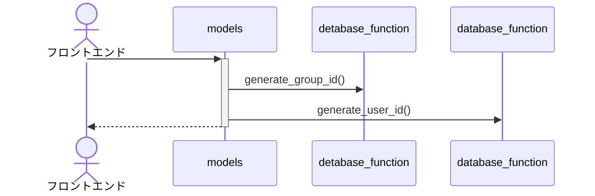
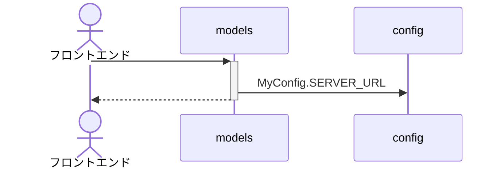
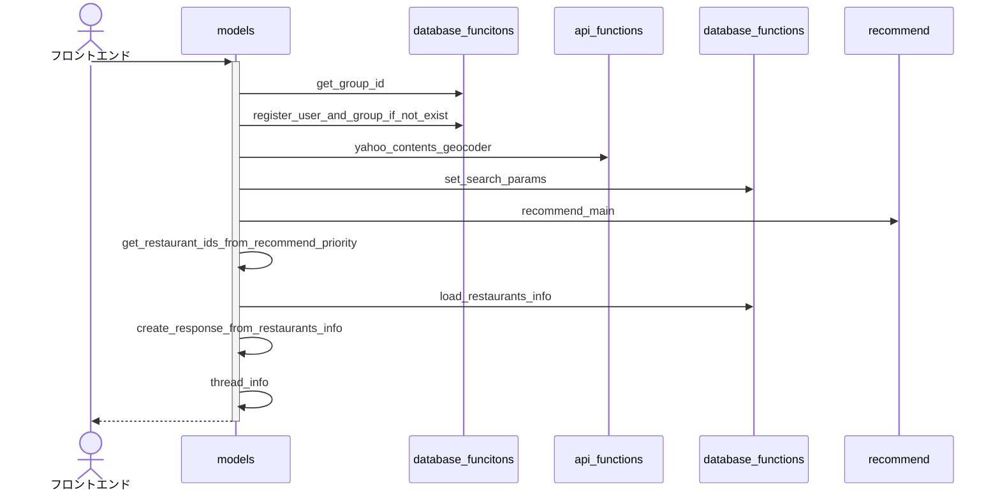
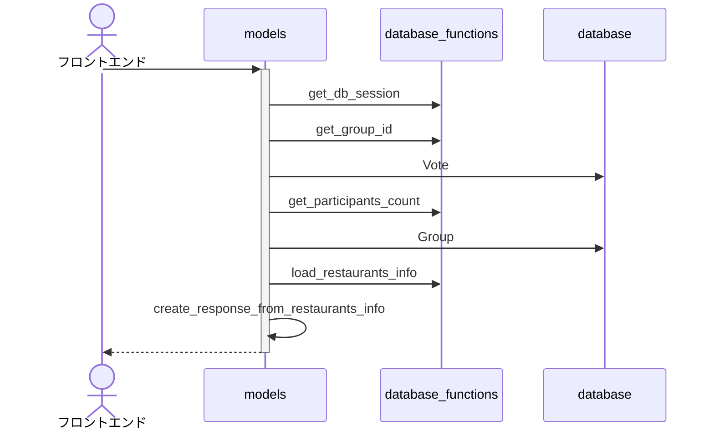
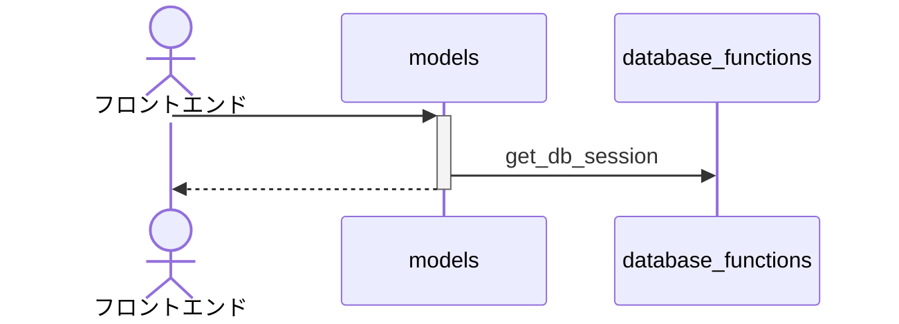

シーケンス図
================

## init


## invite



## info


## feeling
```mermaid
sequenceDiagram
    actor フロントエンド
    participant RecommendSVMなど as RecommendSVM
    
    フロントエンド ->>+ models : 
    models ->> database_functions : get_db_session
    database_functions ->> database : User, Group, Belong
    models ->> database_functions : get_group_id
    database_functions ->> database : Belong
    models ->> database_functions : update_feeling
    database_functions ->> database : History, Vote
    models ->> database_functions : get_participants_count
    models ->> database : Belong : null
    models ->>+ models_thread_info : null
    models -->>- フロントエンド : null
    models_thread_info ->> database_functions : get_db_session
    models_thread_info ->>+ recommend : recommend_main
    alt 初回
        recommend ->> recommend : first_time_recommend_main
    end
    recommend ->> database_functions : get_histories_restaurants 検索履歴を取得
    recommend ->> database_functions : get_db_session 
    recommend ->> database : Vote
    recommend ->> database_functions : load_restaurants_info
    recommend ->> database_functions : get_search_params_from_fetch_group 検索条件を取得
    recommend ->>+ RecommendSVM : set_search_params 検索条件を設定
    RecommendSVM -->>- recommend : null
    recommend ->> database_functions : set_search_params 検索条件を保存
    recommend ->>+ call_api : search_restaurants_info
    // TODO
    call_api -->>- recommend : restaurants_info
    recommend ->> database_functions : save_restaurants
    recommend ->> database_functions : save_votes
    recommend ->>+ RecommendSVM : get_restaurants_info 優先度を計算
    RecommendSVM -->>- recommend : null
    recommend ->>+ call_api : get_restaurants_info
    // TODO
    call_api -->>- recommend : restaurants_info
    recommend ->> database_functions : save_restaurants
    recommend ->> database_functions : save_votes
    recommend -->>- models_thread_info : null
```


## list


## history


## decision


## test
```mermaid
sequenceDiagram
```

