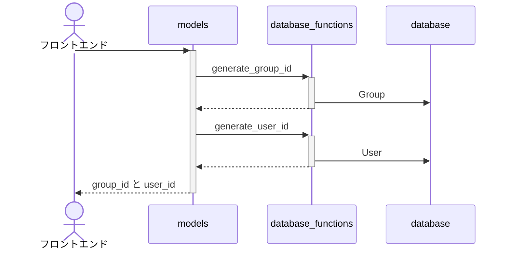
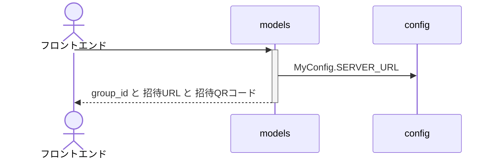
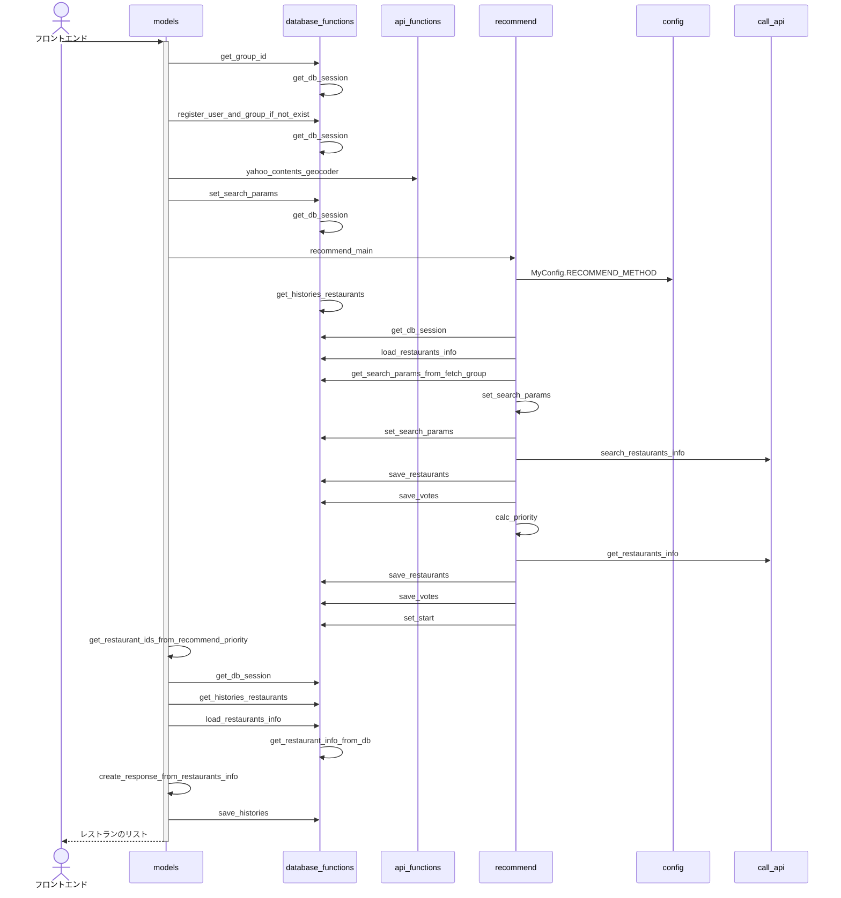
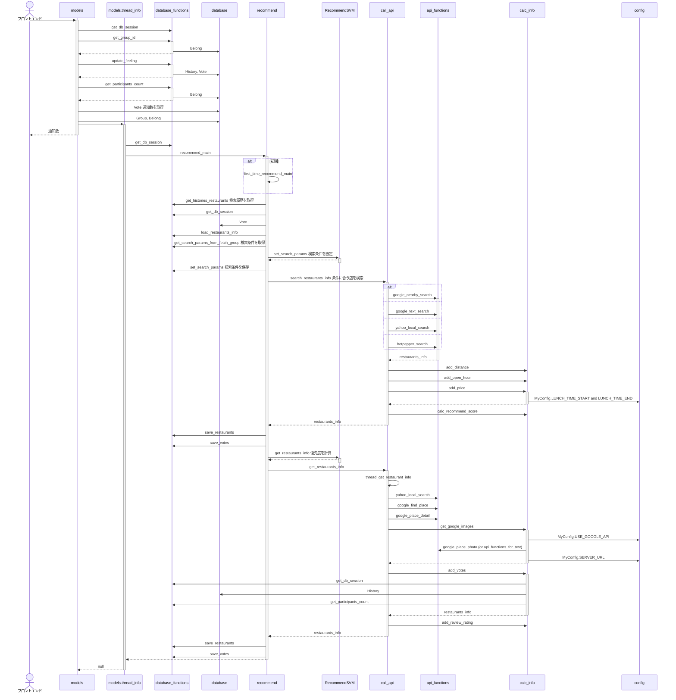
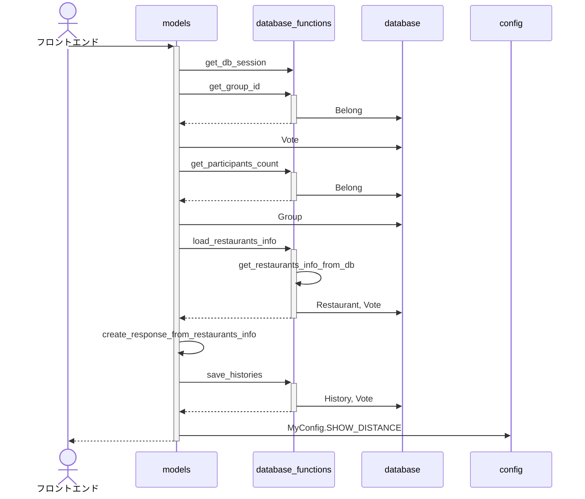
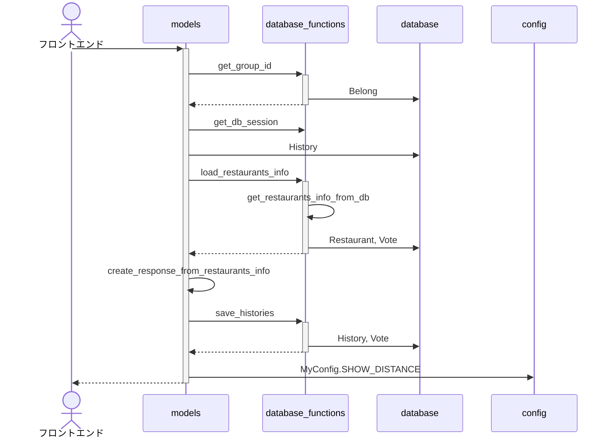

シーケンス図
================

## init

```mermaid
sequenceDiagram
    actor フロントエンド
    
    フロントエンド ->>+ models : 
    models ->>+ database_functions : generate_group_id
    database_functions ->> database : Group
    database_functions -->>- models : 
    models ->>+ database_functions : generate_user_id
    database_functions ->> database : User
    database_functions -->>- models : 
    models -->>- フロントエンド : group_id と user_id
```

## invite

```mermaid
sequenceDiagram
    actor フロントエンド
    
    フロントエンド ->>+ models : 
    models ->> config : MyConfig.SERVER_URL
    models -->>- フロントエンド : group_id と 招待URL と 招待QRコード
```

## info

```mermaid
sequenceDiagram
    actor フロントエンド
    
    フロントエンド ->>+ models : 
    models ->> database_functions : get_group_id
    database_functions ->> database_functions : get_db_session
    models ->> database_functions : register_user_and_group_if_not_exist
    database_functions ->> database_functions : get_db_session
    models ->> api_functions : yahoo_contents_geocoder
    models ->> database_functions : set_search_params
    database_functions ->> database_functions : get_db_session
    models ->> recommend : recommend_main
    recommend ->> config : MyConfig.RECOMMEND_METHOD
    database_functions ->> database_functions : get_histories_restaurants
    recommend ->> database_functions : get_db_session
    recommend ->> database_functions : load_restaurants_info
    recommend ->> database_functions : get_search_params_from_fetch_group
    recommend ->> recommend : set_search_params
    recommend ->> database_functions : set_search_params
    recommend ->> call_api : search_restaurants_info
    recommend ->> database_functions : save_restaurants
    recommend ->> database_functions : save_votes
    recommend ->> recommend : calc_priority
    recommend ->> call_api : get_restaurants_info
    recommend ->> database_functions : save_restaurants
    recommend ->> database_functions : save_votes
    recommend ->> database_functions : set_start
    models ->> models : get_restaurant_ids_from_recommend_priority
    models ->> database_functions : get_db_session
    models ->> database_functions : get_histories_restaurants
    models ->> database_functions : load_restaurants_info
    database_functions ->> database_functions : get_restaurant_info_from_db
    models ->> models : create_response_from_restaurants_info
    models ->> database_functions : save_histories
    models -->>- フロントエンド : レストランのリスト
```

## feeling

```mermaid
sequenceDiagram
    actor フロントエンド
    participant models
    participant models_thread_info as models.thread_info
    
    フロントエンド ->>+ models : 
    models ->> database_functions : get_db_session
    models ->>+ database_functions : get_group_id
    database_functions ->> database : Belong
    database_functions -->>- models : 
    models ->>+ database_functions : update_feeling
    database_functions ->> database : History, Vote
    database_functions -->>- models : 
    models ->>+ database_functions : get_participants_count
    database_functions ->> database : Belong
    database_functions -->>- models : 
    models ->> database : Vote 通知数を取得
    models ->> database : Group, Belong
    models ->>+ models_thread_info : 
    models -->>- フロントエンド : 通知数
    models_thread_info ->> database_functions : get_db_session
    models_thread_info ->>+ recommend : recommend_main
    alt 初回
        recommend ->> recommend : first_time_recommend_main
    end
    recommend ->> database_functions : get_histories_restaurants 検索履歴を取得
    recommend ->> database_functions : get_db_session 
    recommend ->> database : Vote
    recommend ->> database_functions : load_restaurants_info
    recommend ->> database_functions : get_search_params_from_fetch_group 検索条件を取得
    recommend ->>+ RecommendSVM : set_search_params 検索条件を設定
    RecommendSVM -->>- recommend : 
    recommend ->> database_functions : set_search_params 検索条件を保存
    recommend ->>+ call_api : search_restaurants_info 条件に合う店を検索
    alt
        call_api ->>+ api_functions : google_nearby_search
    else
        call_api ->> api_functions : google_text_search
    else
        call_api ->> api_functions : yahoo_local_search
    else
        call_api ->> api_functions : hotpepper_search
    end
    api_functions -->>- call_api : restaurants_info    
    call_api ->> calc_info : add_distance
    call_api ->> calc_info : add_open_hour
    call_api ->>+ calc_info : add_price
    calc_info ->> config : MyConfig.LUNCH_TIME_START and LUNCH_TIME_END
    calc_info -->>- call_api : 
    call_api ->> calc_info : calc_recommend_score
    call_api -->>- recommend : restaurants_info
    recommend ->> database_functions : save_restaurants
    recommend ->> database_functions : save_votes
    recommend ->>+ RecommendSVM : get_restaurants_info 優先度を計算
    RecommendSVM -->>- recommend : 
    recommend ->>+ call_api : get_restaurants_info
    call_api ->> call_api : thread_get_restaurant_info
    call_api ->> api_functions : yahoo_local_search
    call_api ->> api_functions : google_find_place
    call_api ->> api_functions : google_place_detail
    call_api ->>+ calc_info : get_google_images
    calc_info ->> config : MyConfig.USE_GOOGLE_API
    calc_info ->> api_functions : google_place_photo (or api_functions_for_test)
    calc_info ->> config : MyConfig.SERVER_URL
    calc_info -->>- call_api : 
    call_api ->>+ calc_info : add_votes
    calc_info ->> database_functions : get_db_session
    calc_info ->> database : History
    calc_info ->> database_functions : get_participants_count
    calc_info -->>- call_api : restaurants_info
    call_api ->> calc_info : add_review_rating
    call_api -->>- recommend : restaurants_info
    recommend ->> database_functions : save_restaurants
    recommend ->> database_functions : save_votes
    recommend -->>- models_thread_info : 
    models_thread_info -->>- models : null
```

## list

```mermaid
sequenceDiagram
    actor フロントエンド
    
    フロントエンド ->>+ models : 
    models ->> database_functions : get_db_session
    models ->>+ database_functions : get_group_id
    database_functions ->> database : Belong
    database_functions -->>- models : 
    models ->> database : Vote
    models ->>+ database_functions : get_participants_count
    database_functions ->> database : Belong
    database_functions -->>- models : 
    models ->> database : Group
    models ->>+ database_functions : load_restaurants_info
    database_functions ->> database_functions : get_restaurants_info_from_db
    database_functions ->> database : Restaurant, Vote
    database_functions -->>- models : 
    models ->> models : create_response_from_restaurants_info
    models ->>+ database_functions : save_histories
    database_functions ->> database : History, Vote
    database_functions -->>- models : 
    models ->> config : MyConfig.SHOW_DISTANCE
    models -->>- フロントエンド : 
```

## history

```mermaid
sequenceDiagram
    actor フロントエンド
    
    フロントエンド ->>+ models : 
    models ->>+ database_functions : get_group_id
    database_functions ->> database : Belong
    database_functions -->>- models : 
    models ->> database_functions : get_db_session
    models ->> database : History
    models ->>+ database_functions : load_restaurants_info
    database_functions ->> database_functions : get_restaurants_info_from_db
    database_functions ->> database : Restaurant, Vote
    database_functions -->>- models : 
    models ->> models : create_response_from_restaurants_info
    models ->>+ database_functions : save_histories
    database_functions ->> database : History, Vote
    database_functions -->>- models : 
    models ->> config : MyConfig.SHOW_DISTANCE
    models -->>- フロントエンド : 
```

## decision

## image

## test

